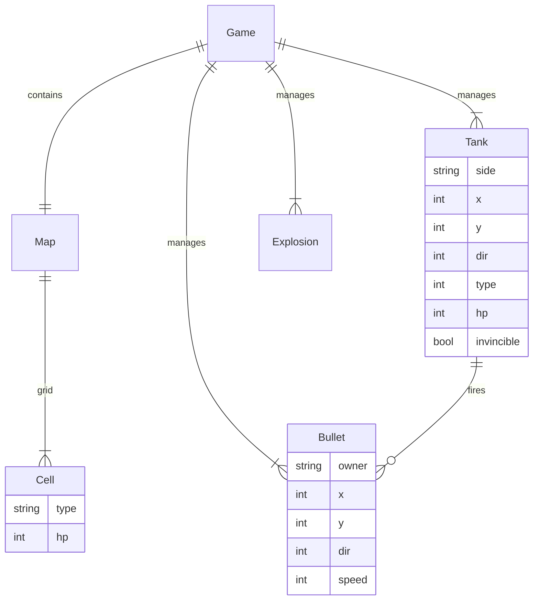

## 1. 架构设计

```mermaid
flowchart TD
    "A[浏览器]" --> "B[index.html 单文件]"
    "B --> C[渲染层 Canvas 2D]"
    "B --> D[游戏引擎 Game Loop]"
    "D --> E[输入管理 Input]"
    "D --> F[实体管理 Entities]"
    "D --> G[碰撞检测 Collision]"
    "D --> H[地图系统 Map]"
    "D --> I[AI 系统]"
    "D --> J[状态机 FSM]"
    "F --> F1[PlayerTank]"
    "F --> F2[EnemyTank]"
    "F --> F3[Bullet]"
    "F --> F4[Wall]"
    "F --> F5[Explosion]"
    "J --> J1[MenuState]"
    "J --> J2[PlayState]"
    "J --> J3[PauseState]"
    "J --> J4[GameOverState]"
```

纯前端单文件架构，无后端、无数据库、无外部依赖（仅 Google Fonts CDN）。所有逻辑、样式、资源内联在 index.html 中，可离线运行。

## 2. 技术描述
- 前端：原生 HTML5 + CSS3 + JavaScript (ES6+)，无框架
- 渲染：Canvas 2D API，16×16 像素网格，13×13 格战场
- 资源：所有坦克/墙/爆炸图形用 Canvas 程序化绘制（像素数组映射），无外部图片
- 字体：Press Start 2P（Google Fonts）+ 中文系统字体回退
- 构建：无构建步骤，直接打开 index.html 即可运行
- 初始化工具：无（手写单文件）

## 3. 路由定义
单页应用，无路由。通过游戏状态机切换界面：
| 状态 | 用途 |
|-------|---------|
| MENU | 开始界面，显示标题与开始按钮 |
| PLAYING | 游戏进行中，渲染战场与 HUD |
| PAUSED | 暂停遮罩 |
| GAME_OVER | 失败结算 |
| STAGE_CLEAR | 关卡通过/胜利结算 |

## 4. API 定义
不适用（纯前端单机游戏，无后端 API）。

## 5. 服务器架构
不适用（无后端）。

## 6. 数据模型

### 6.1 数据模型定义
所有数据保存在内存 JS 对象中，无持久化（可选 localStorage 存最高分）。



### 6.2 数据定义语言
不适用（无数据库）。地图使用二维数组定义：

```js
// 单元格类型枚举
// 0=空地 1=砖墙 2=钢墙 3=水 4=草丛 5=基地
// 关卡数据：13×13 网格，每格 32px
const STAGES = [
  [ /* 第1关 13×13 数组 */ ],
  [ /* 第2关 */ ],
  // ...
];
```

## 7. 关键技术点
- **游戏循环**：requestAnimationFrame + 固定时间步长（60FPS），更新与渲染分离
- **碰撞检测**：AABB 矩形碰撞，坦克-墙、子弹-墙、子弹-坦克、坦克-坦克
- **AI 系统**：敌方坦克定时随机转向 + 朝向障碍/玩家时射击；4 种类型差异化属性
- **像素绘制**：用 8×8 像素位图数组定义坦克造型，按方向旋转绘制
- **音效**（可选）：Web Audio API 合成简单射击/爆炸音，无外部音频文件
- **移动端**：检测触摸设备，注入虚拟按键 DOM 覆盖层
